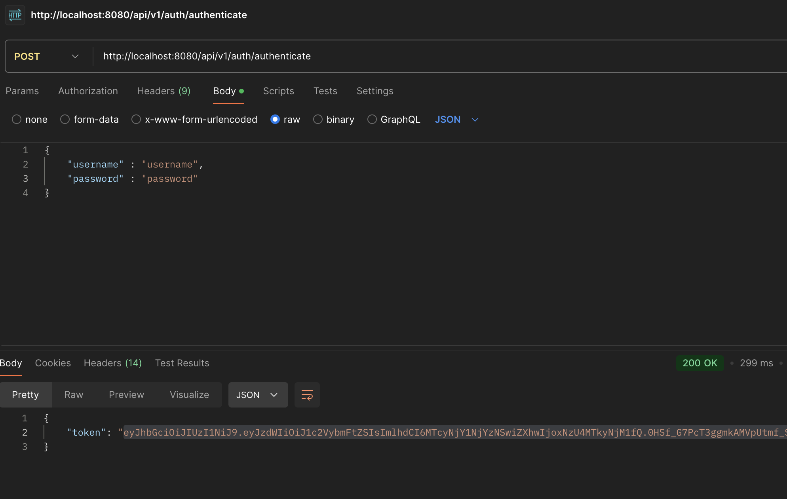

<h1 align="center">Event Management API</h1>

This readme details a Spring Boot-based Event Management API utilizing MongoDB, Redis, Docker, Lombok and JWT.

<h2>Technologies</h2>

<ul>
  <li><strong>Backend:</strong> Spring Boot, Java</li>
  <li><strong>Database:</strong> MongoDB</li>
  <li><strong>Caching:</strong> Redis</li>
  <li><strong>Authentication:</strong> JWT</li>
  <li><strong>Containerization:</strong> Docker</li>
</ul>

<h2>Project Structure</h2>

<ul>
  <li><strong>controller:</strong> REST controllers managing events and users.</li>
  <li><strong>entity:</strong> Data models for events and users.</li>
  <li><strong>service:</strong> Business logic for event and user management.</li>
  <li><strong>config:</strong> Configuration files for JWT, Redis caching, and other services.</li>
  <li><strong>docker:</strong> Dockerfile and docker-compose.yml for building and running the application.</li>
  <li><strong>tests:</strong> Unit tests for controllers and services.</li>
</ul>

<h2>Endpoints</h2>

<h3>EventController Endpoints</h3>

<table>
  <tr>
    <th>Endpoint</th>
    <th>Description</th>
    <th>Authentication</th>
    <th>Role</th>
  </tr>
  <tr>
    <td>GET /api/v1/events</td>
    <td>Retrieve a list of all events.</td>
    <td>Required</td>
    <td>Admin</td>
  </tr>
  <tr>
    <td>GET /api/v1/events/{id}</td>
    <td>Obtain an event by its ID.</td>
    <td>Required</td>
    <td>Admin</td>
  </tr>
  <tr>
    <td>POST /api/v1/events/create</td>
    <td>Create a new event.</td>
    <td>Required</td>
    <td>Admin</td>
  </tr>
  <tr>
    <td>PUT /api/v1/events/update/{id}</td>
    <td>Update an existing event.</td>
    <td>Required</td>
    <td>Admin</td>
  </tr>
  <tr>
    <td>DELETE /api/v1/events/delete/{id}</td>
    <td>Delete an event.</td>
    <td>Required</td>
    <td>Admin</td>
  </tr>
</table>

<h3>UserController Endpoints</h3>

<table>
  <tr>
    <th>Endpoint</th>
    <th>Description</th>
    <th>Authentication</th>
    <th>Role</th>
  </tr>
  <tr>
    <td>POST /api/v1/users/create</td>
    <td>Register a new user.</td>
    <td>Public</td>
    <td>None</td>
  </tr>
  <tr>
    <td>GET /api/v1/users/{id}</td>
    <td>Retrieve a user by their ID.</td>
    <td>Required</td>
    <td>User</td>
  </tr>
  <tr>
    <td>PUT /api/v1/users/{id}</td>
    <td>Update a user's profile.</td>
    <td>Required</td>
    <td>User</td>
  </tr>
  <tr>
    <td>DELETE /api/v1/users/{id}</td>
    <td>Delete a user.</td>
    <td>Required</td>
    <td>Admin</td>
  </tr>
</table>

<h3>AuthenticationController Endpoints</h3>

<table>
  <tr>
    <th>Endpoint</th>
    <th>Description</th>
    <th>Authentication</th>
    <th>Role</th>
  </tr>

  <tr>
    <td>POST /api/v1/auth/authenticate</td>
    <td>Authenticate a user and receive a JWT token.</td>
    <td>Public</td>
    <td>User</td>
  </tr>
</table>

<h2>Authorization</h2>

Only users with the <strong>ADMIN</strong> role can create, update, and delete events.

Only authenticated users can access their own profile information.

<h2>Notes</h2>

<ul>
  <li>This is a basic example and may require adjustments for your specific needs.</li>
  <li>Configure your own MongoDB, Redis, and Docker environments.</li>
  <li>Implement your own security measures to protect data.</li>
</ul>

<h2>Getting Started</h2>

1. Clone the repository.
2. Build and run the application using Docker: "docker-compose up -d"
3. Open http://localhost:8081 in your browser to see Mongo Express.
4. Refer to specific endpoint descriptions for API usage.
5. You can use Postman or Swagger to send requests and take responses from endpoints.

<h2>Additional Information</h2>

<ul>
  <li>This project utilizes Spring Security for authentication and authorization.</li>
  <li>Spring Data MongoDB facilitates interaction with the MongoDB database.</li>
  <li>Spring Cache enables caching frequently accessed data.</li>
</ul>

I hope this helps! Feel free to ask any further questions you may have.

## Sample Images

